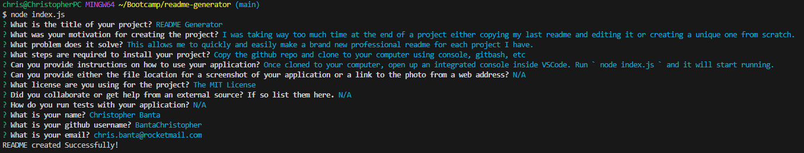

  # README Generator

  [](https://opensource.org/licenses/MIT)

  ## Description

  Hi! Im Christopher Banta! Let me tell you a little about my project.

  ### What was my motivation for creating this project?
  
  I was taking way too much time at the end of a project either copying my last readme and editing it or creating a unique one from scratch.

  ### What problem does this solve?

  This allows me to quickly and easily make a brand new professional readme for each project I have.

  ## Table of Contents

  - [Installation](#installation)
  - [Usage](#usage)
  - [License](#license)
  - [Contributing](#contributing)
  - [Tests](#tests)
  - [Questions](#questions)

  ## Installation

  Copy the github repo and clone to your computer using console, gitbash, etc

  ## Usage

  Once cloned to your computer, open up an integrated console inside VSCode. Run ```node index.js``` and it will start running.

  
  
  

  [Web Video Demo](https://drive.google.com/file/d/1hXo0fWbAQLZvzyD_6X4LYs9tNggWvO4j/view)

  ## License

[](https://opensource.org/licenses/MIT)

This project is covered under the MIT License.

  ## Contributing

  N/A

  ## Tests

  N/A

  ## Questions

  For any questions or further inquiries feel free to contact me at either of the following:
  
  Github: [BantaChristopher](https://github.com/BantaChristopher)

  Email: <chris.banta@rocketmail.com>

  